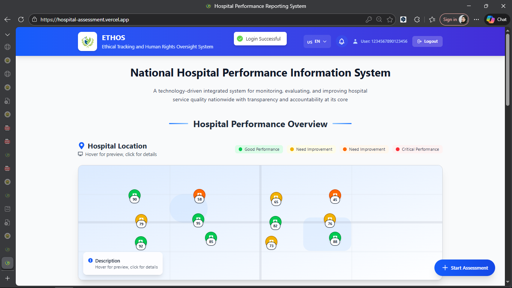
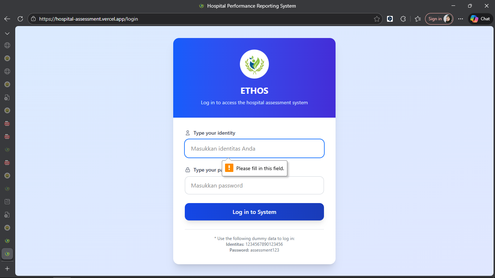
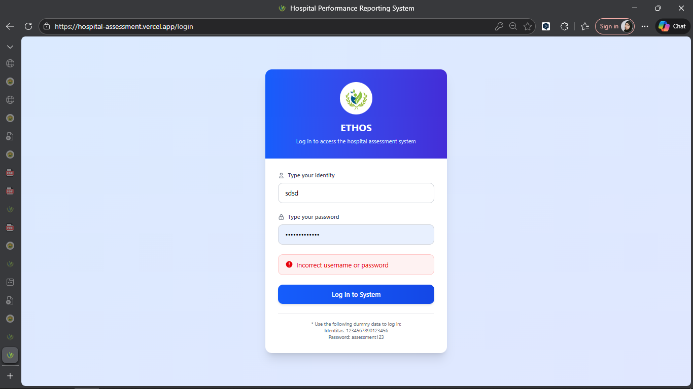
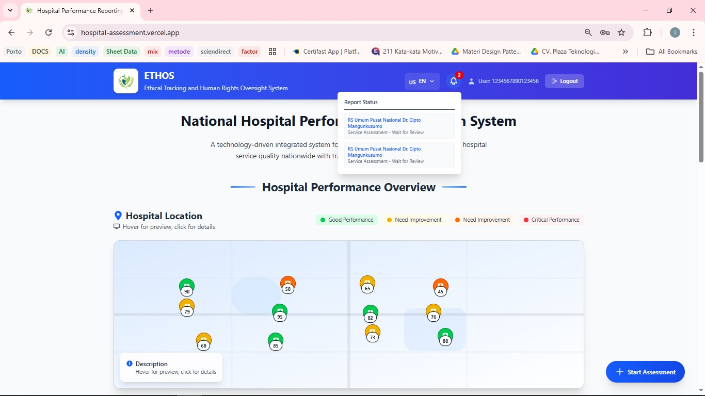

# Hospital Assessment Web – QA Testing Documentation

#  1. Project Overview

This repository contains structured manual testing documentation for the Hospital Assessment Web Application.

Since the application uses dummy data, testing was focused on:
- Frontend validation logic
- Functional behavior
- User interaction flow
- UI responsiveness
- State handling

Backend persistence testing was excluded due to the absence of real database integration.

---

# 2. Test Objective

To validate that the application:
- Properly enforces input validation
- Handles user interactions correctly
- Prevents invalid submissions
- Maintains UI consistency across devices

---

# 3. Test Scope

## In Scope
- Form validation testing
- Submission flow validation
- Negative testing
- Edge case testing
- Responsive UI testing

## Out of Scope
- Backend database persistence
- Performance stress testing
- Security penetration testing

---

# 4. Test Cases

## TC-01 – Valid Form Submission

**Steps:**
1. Open the website
2. Fill all required fields with valid data
3. Click Submit

**Expected Result:**
Success message is displayed.

PASSED

  

---

## TC-02 – Empty Required Field

**Steps:**
1. Leave one required field empty
2. Click Submit

**Expected Result:**
Validation message appears and submission is blocked.

PASSED

  

---

## TC-03 – Invalid Data Type

**Steps:**
1. Enter text in numeric rating field
2. Click Submit

**Expected Result:**
System rejects invalid input format.

PASSED

  

---

## TC-04 – Duplicate Submission

**Steps:**
1. Fill out the form
2. Click Submit multiple times quickly

**Expected Result:**
System prevents duplicate submissions or disables button after first click.

FAILED

  

---

## TC-05 – Page Refresh After Submission

**Steps:**
1. Submit valid form
2. Refresh the page

**Expected Result:**
System behavior documented persisted.

---

## TC-06 – Responsive Layout Test

**Steps:**
1. Open browser developer tools
2. Switch to mobile view

**Expected Result:**
Layout adjusts properly without UI breaking.

---

# 5. Sample Bug Report

## Bug ID: BUG-01  
**Title:** Form allows submission with empty required field  

**Environment:** Chrome – Windows 10  

**Steps to Reproduce:**
1. Open form
2. Leave rating field empty
3. Click Submit

**Expected Result:**
System should block submission and show validation error.

**Actual Result:**
Form submitted successfully without required rating.

**Severity:** Medium  
**Priority:** High  

---

## Bug ID: BUG-02  
**Title:** No loading indicator during form submission  

**Severity:** Low  
**Type:** UI/UX Issue  

---

# 6. Risk Analysis

| Risk Area | Potential Impact | Risk Level | Mitigation |
|------------|------------------|------------|------------|
| Weak validation | Incorrect data accepted | High | Strengthen required field validation |
| Duplicate submission | Data inconsistency | Medium | Disable submit button after click |
| No loading state | Poor user experience | Low | Add loading indicator |
| Non-responsive layout | Reduced accessibility | Medium | Improve responsive design |

---

# 7. Requirement Traceability Matrix

| Requirement ID | Requirement Description | Test Case ID | Status |
|----------------|------------------------|--------------|--------|
| R-01 | Required fields must be validated | TC-02 | Completed |
| R-02 | System must reject invalid input | TC-03 | Completed |
| R-03 | User can submit valid assessment | TC-01 | Completed |
| R-04 | UI must be responsive | TC-06 | Completed |

---

# 8. Test Conclusion

The Hospital Assessment Web application functions as expected for basic form submission. However, improvements are recommended in validation enforcement, duplicate submission prevention, and UI feedback mechanisms.

Testing focused on frontend behavior due to the use of dummy data.

---

# 🚀 Skills Demonstrated

- Manual Testing
- Functional Testing
- Negative Testing
- Test Case Documentation
- Bug Reporting
- Risk Analysis
- Requirement Traceability

